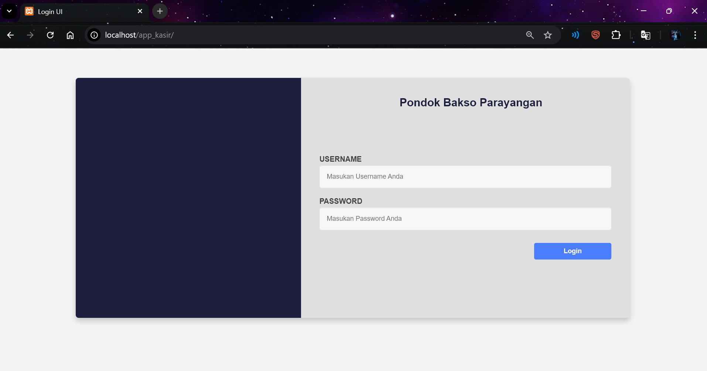
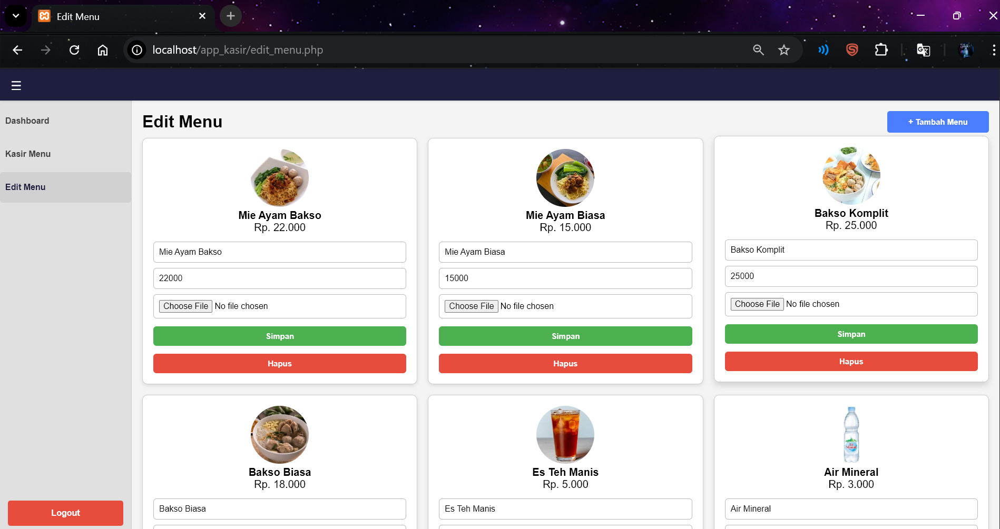
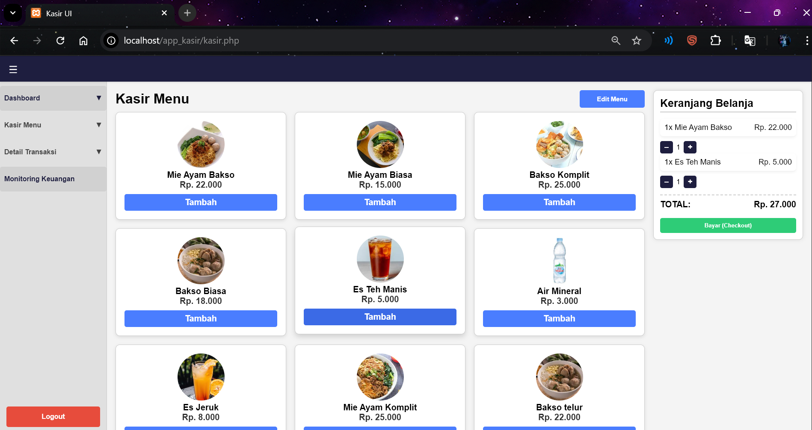
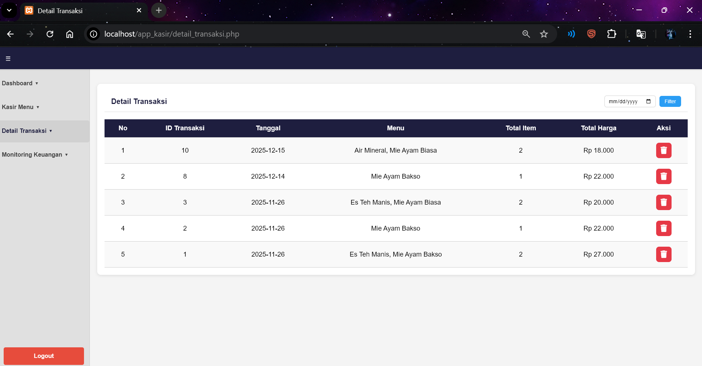
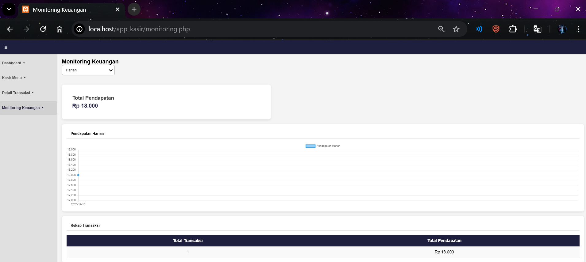

# 🍽️ Aplikasi Kasir Rumah Makan (PHP Native)

Aplikasi Kasir Rumah Makan adalah aplikasi berbasis web yang dikembangkan menggunakan PHP Native dan MySQL untuk membantu pengelolaan transaksi penjualan pada usaha kuliner. Aplikasi ini dirancang untuk mempermudah proses pencatatan pesanan, pengelolaan menu, serta monitoring transaksi secara terstruktur dan efisien.

Dengan antarmuka yang sederhana dan mudah digunakan, aplikasi ini cocok digunakan pada rumah makan atau usaha kuliner skala kecil hingga menengah untuk meningkatkan ketertiban pencatatan dan efisiensi operasional.

## 🛠️ Teknologi yang Digunakan
| Teknologi | Keterangan |
|-----------|------------|
| PHP Native | Bahasa pemrograman backend |
| MySQL | Database |
| HTML / CSS | UI tampilan |
| XAMPP / Localhost | Server lokal |

## 🧰 Fitur Utama
- Login 

Fitur login memiliki tiga role utama, yaitu Admin, Kasir, dan Manajer yang dapat masuk kedalam aplikasi username
dan password seperti dibawah ini :

    | Username | password |
    |-----------|------------|
    | admin | 123 |
    | kasir | 123 |
    | manager| 123 |

- Dashboard 

Dashboard menampilkan ringkasan informasi keuangan utama aplikasi, seperti pendapatan harian, pendapatan bulanan dan pendapatan tahunan.Halaman ini berfungsi sebagai pusat informasi keuangan agar pengguna dapat dengan cepat mengakses informasi keuangan.

- Manajemen menu

Fitur ini memungkinkan pengguna untuk mengelola data menu makanan dan minuman. Pengguna dapat menambahkan menu baru, mengubah data menu, serta menghapus menu yang sudah tidak dijual. seperti pada menu edit digunakan untuk memperbarui data menu yang sudah ada, seperti perubahan harga atau nama menu seperti :
1. klik edit menu
2. selanjutnya dapat memperbarui harga menu, nama menu, gambar menu, dan hapus menu
3. klik simpan untuk menyimpan, Perubahan akan langsung tersimpan ke database. 

dan Pada halaman tambah menu, pengguna dapat memasukkan nama menu, harga, dan informasi lain yang dibutuhkan 
seperti :

1. klik tambah menu di halaman edit menu
2. masukan nama menu, harga, dan gambar menu 
3. klik simpan untuk menambahkan menu pada daftar menu.

- Proses transaksi kasir
  
Fitur ini digunakan untuk melakukan transaksi penjualan. Kasir dapat memilih menu, menentukan jumlah pesanan, dan menghitung total harga secara otomatis. Setelah transaksi disimpan, data akan tercatat dalam sistem. dengan cara :
1. klik menu yang di pesan 
2. klik tombol tambah/kurang untuk jumlah pesanan yang dipesan
3. klik bayar untuk menyelesaikan transaksi.

- Detail transaksi 
 
Detail transaksi menampilkan rincian setiap penjualan, seperti daftar menu yang dibeli, jumlah, harga, dan total pembayaran. Fitur ini membantu dalam pengecekan transaksi dan meminimalkan kesalahan pencatatan. dan dapat menghapus transaksi jika ada kesalahan input atau kesalahan pembayaran. dan dapat di filter sesuai dengan tanggal untuk memudahkan pencarian.

- Monitoring transaksi
  
Fitur monitoring digunakan untuk melihat riwayat transaksi yang telah dilakukan dari transaksi harian, bulanan dan tahunan bisa dilihat dengan memfilter sesuai dengan yang di mau seperti transaksi harian, bulanan atau tahunan. Data ini dapat menampilkan jumlah transaski yang sudah dilakukan dan dapat digunakan untuk analisis usaha, serta evaluasi performa usaha karena di dukung dengan grafik total pendapatan.

⚙️ Cara Instalasi & Menjalankan Aplikasi
1. download xampp 
2. pull code pada github (https://github.com/MhmadFarhan/Aplikasi_kasir)
3. import database ke phpmyadmin atau sql server lainnya
4. jalankan aplikasi dengan cara : http://localhost/app_kasir
5. login dengan username dan password yang sudah diberikan
6. lakukan transaksi atau manajemen menu 